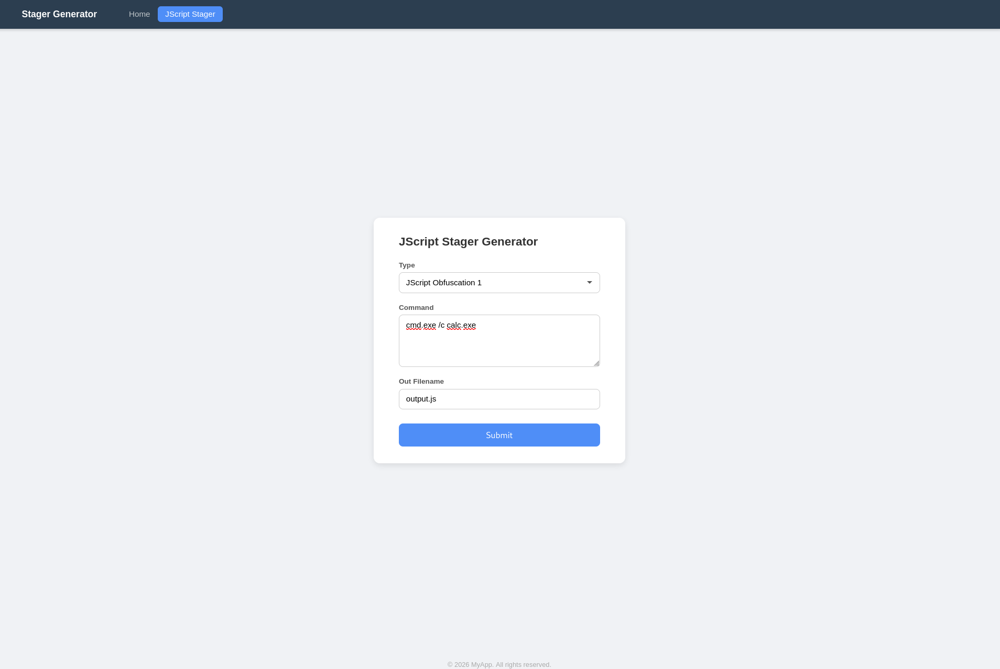

# Simple Stager Generator Web Application

Disclaimer: This application is solely for educational purposes.

This is a simple web application that takes a Windows command line as input and generates an obfuscated JScript stager file. These stager files can be used in Red Team engagements to simulate behaviours of real world attacks.

This project is created with the assistance of Claude.

# Requirements:
- Go >= 1.25.0

# Commands
To build the executable
```
make build
```

To run the application (in debug mode)
```
# Directly using makefile
make run
```

To run the application (in release mode)
```
# Run after building the application
./stager_generator		# Linux
./stager_generator.exe 	# Windows
```

Application can be reached by visiting `http://localhost:8888/home` on a browser.

To generate a sample stager file for each obfuscation method:
```
go test
```
Output files are located at the root directory

# Example Screenshot

